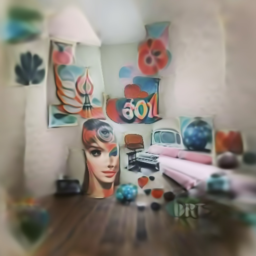
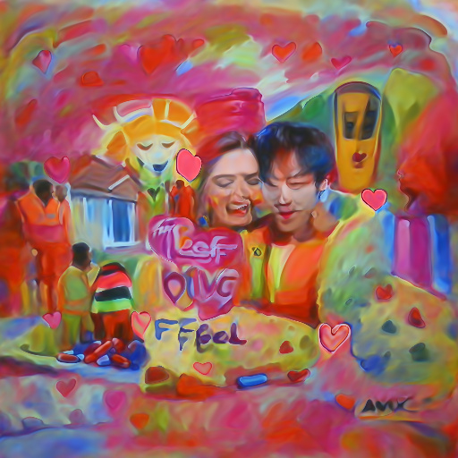
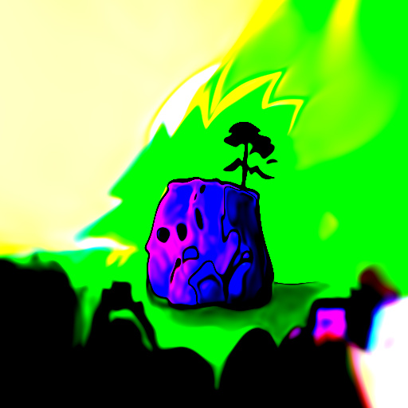
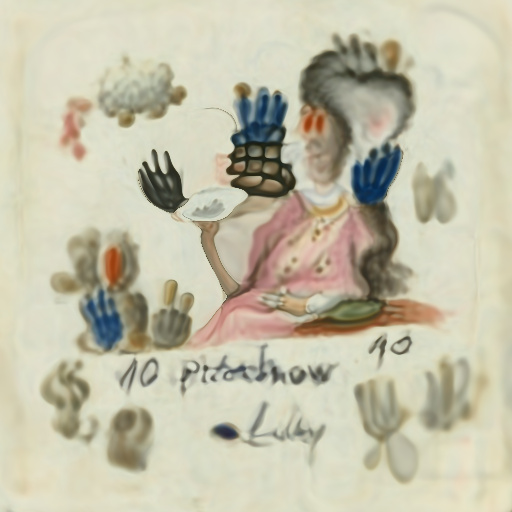
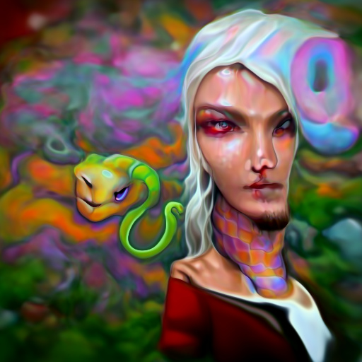
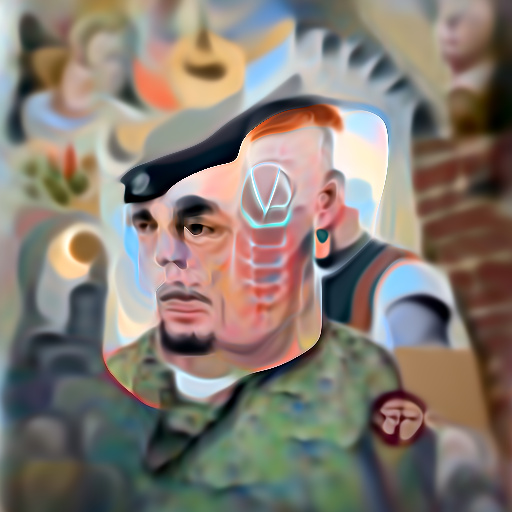
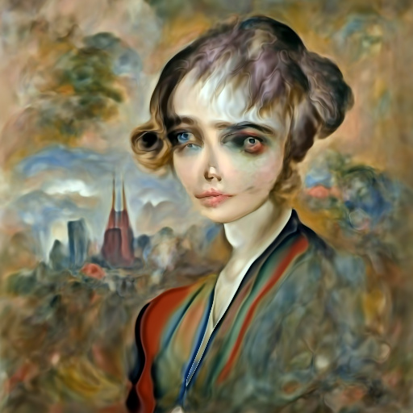

## What is this?

Simple command line tool for text to image generation using OpenAI's <a href="https://github.com/openai/CLIP">CLIP</a> and <a href="https://arxiv.org/abs/2006.09661">Siren</a>. Credit goes to <a href="https://twitter.com/advadnoun">Ryan Murdock</a> for the discovery of this technique (and for coming up with the great name)!

Original notebook [![Open In Colab][colab-badge]][colab-notebook]

New simplified notebook [![Open In Colab][colab-badge]][colab-notebook-2]

[colab-notebook]: <https://colab.research.google.com/drive/1FoHdqoqKntliaQKnMoNs3yn5EALqWtvP>
[colab-notebook-2]: <https://colab.research.google.com/drive/1_YOHdORb0Fg1Q7vWZ_KlrtFe9Ur3pmVj?usp=sharing>
[colab-badge]: <https://colab.research.google.com/assets/colab-badge.svg>

This will require that you have an Nvidia GPU or AMD GPU, as well as Python
- Recommended: 16GB VRAM
- Minimum Requirements: 4GB VRAM (Using VERY LOW settings, see usage instructions below)

## Example Generated Images

| Sample Image  | Sample Text   |
| ------------- | ------------- |
| </img>  | 60s style art decor room |
| </img>  | A bright colourful painting of the love I feel |
| </img>  | A cat's face on the side of a mug on a computer_table |
| </img>  | A comic art styled rock with a tree growing out of it |
| </img>  | A painting of a mermaid building a weirdly surreal artistic table |
| </img>  | A portrait of lady with putas with a glove on her hand plate 60 no 78 |
| </img>  | A surreal painting of a psychedelic snake you create online  |
| </img>  | A vector art portrait painting of the character. Give him a neck tattoo  | 
| </img>  | This portrait was painted by Walter Lasker who died in New York in 1927  | 

## What is in this fork?

Just some hacks to deep-daze to include:
* A range of optimisers
* Stories can now include images, rather just just pure text
* A second image can be specified
* All encodings (text, img, img2) have strength options

## Install

```bash
$ pip install git+https://github.com/nerdyrodent/deep-daze
```  

## Example usage

```bash
$ imagine "a rodent using a computer"
```

### Advanced

```bash
$ imagine "A castle in the sky" --epochs=2 --iterations=512 --save_every=5122 --save_progress --open_folder=False --batch_size=8 --num-layers 24
```

## Usage

### CLI
```bash
NAME
    imagine

SYNOPSIS
    imagine TEXT <flags>

POSITIONAL ARGUMENTS
    TEXT
        (required) A phrase less than 77 tokens which you would like to visualize.

FLAGS
    --img=IMAGE_PATH
        Default: None
        Path to png/jpg image or PIL image to optimize on
    --encoding=ENCODING
        Default: None
        User-created custom CLIP encoding. If used, replaces any text or image that was used.
    --create_story=CREATE_STORY
        Default: False
        Creates a story by optimizing each epoch on a new sliding-window of the input words. If this is enabled, much longer texts than 77 tokens can be used. Requires save_progress to visualize the transitions of the story.
    --story_start_words=STORY_START_WORDS
        Default: 5
        Only used if create_story is True. How many words to optimize on for the first epoch.
    --story_words_per_epoch=STORY_WORDS_PER_EPOCH
        Default: 5
        Only used if create_story is True. How many words to add to the optimization goal per epoch after the first one.
    --story_separator:
        Default: None
        Only used if create_story is True. Defines a separator like '.' that splits the text into groups for each epoch. Separator needs to be in the text otherwise it will be ignored
    --lower_bound_cutout=LOWER_BOUND_CUTOUT
        Default: 0.1
        Lower bound of the sampling of the size of the random cut-out of the SIREN image per batch. Should be smaller than 0.8.
    --upper_bound_cutout=UPPER_BOUND_CUTOUT
        Default: 1.0
        Upper bound of the sampling of the size of the random cut-out of the SIREN image per batch. Should probably stay at 1.0.
    --saturate_bound=SATURATE_BOUND
        Default: False
        If True, the LOWER_BOUND_CUTOUT is linearly increased to 0.75 during training.
    --learning_rate=LEARNING_RATE
        Default: 1e-05
        The learning rate of the neural net.
    --num_layers=NUM_LAYERS
        Default: 16
        The number of hidden layers to use in the Siren neural net.
    --batch_size=BATCH_SIZE
        Default: 4
        The number of generated images to pass into Siren before calculating loss. Decreasing this can lower memory and accuracy.
    --gradient_accumulate_every=GRADIENT_ACCUMULATE_EVERY
        Default: 4
        Calculate a weighted loss of n samples for each iteration. Increasing this can help increase accuracy with lower batch sizes.
    --epochs=EPOCHS
        Default: 20
        The number of epochs to run.
    --iterations=ITERATIONS
        Default: 1050
        The number of times to calculate and backpropagate loss in a given epoch.
    --save_every=SAVE_EVERY
        Default: 100
        Generate an image every time iterations is a multiple of this number.
    --image_width=IMAGE_WIDTH
        Default: 512
        The desired resolution of the image.
    --deeper=DEEPER
        Default: False
        Uses a Siren neural net with 32 hidden layers.
    --overwrite=OVERWRITE
        Default: False
        Whether or not to overwrite existing generated images of the same name.
    --save_progress=SAVE_PROGRESS
        Default: False
        Whether or not to save images generated before training Siren is complete.
    --seed=SEED
        Type: Optional[]
        Default: None
        A seed to be used for deterministic runs.
    --open_folder=OPEN_FOLDER
        Default: True
        Whether or not to open a folder showing your generated images.
    --save_date_time=SAVE_DATE_TIME
        Default: False
        Save files with a timestamp prepended e.g. `%y%m%d-%H%M%S-my_phrase_here`
    --start_image_path=START_IMAGE_PATH
        Default: None
        The generator is trained first on a starting image before steered towards the textual input
    --start_image_train_iters=START_IMAGE_TRAIN_ITERS
        Default: 50
        The number of steps for the initial training on the starting image
    --theta_initial=THETA_INITIAL
        Default: 30.0
        Hyperparameter describing the frequency of the color space. Only applies to the first layer of the network.
    --theta_hidden=THETA_INITIAL
        Default: 30.0
        Hyperparameter describing the frequency of the color space. Only applies to the hidden layers of the network.
    --save_gif=SAVE_GIF
        Default: False
        Whether or not to save a GIF animation of the generation procedure. Only works if save_progress is set to True.
    --optimizer=OPTIMIZER
        Default: AdamP
        Available optimiser options: AdamP, Adam, DiffGrad, Adagrad, AdamW, Adamax, Adadelta, AdaBelief, Yogi, NovoGrad, Shampoo (slow), SWATS
    --img2
        Default: None
        Path to second png/jpg image or PIL image to optimize on
    --text_str
        Default: 1
        Strength of text
    --img_str
        Default: 1
        Strength of first image
    --img2_str
        Default: 1
        Strength of second image
```

### Optimisers

Different optimisers work better with different learning rates. Some suggested maximums are shown below:

Adadelta	= 0.025,
Adagrad     = 0.0005,
AdaBelief	= 0.00005,
AdamP	    = 0.00005,
AdamW	    = 0.00005,
Adamax	    = 0.00005,
DiffGrad    = 0.00005,
Yogi        = 0.00003,
SWATS       = 0.0001,
NovoGrad    = 0.0005

### Priming

Technique first devised and shared by <a href="https://twitter.com/quasimondo">Mario Klingemann</a>, it allows you to prime the generator network with a starting image, before being steered towards the text.

Simply specify the path to the image you wish to use, and optionally the number of initial training steps.

```bash
$ imagine 'a clear night sky filled with stars' --start_image_path ./cloudy-night-sky.jpg
```

Primed starting image

</img>

Then trained with the prompt `A pizza with green pepper.`

</img>


### Optimize for the interpretation of an image

We can also feed in an image as an optimization goal, instead of only priming the generator network. Deepdaze will then render its own interpretation of that image:
```bash
$ imagine --img samples/Autumn_1875_Frederic_Edwin_Church.jpg
```
Original image:

</img>

The network's interpretation:  

</img>

Original image:

</img>

The network's interpretation:  

</img>

#### Optimize for text and image combined

```bash
$ imagine "A psychedelic experience." --img samples/hot-dog.jpg
```
The network's interpretation:  
</img>


### New: Create a story
The regular mode for texts only allows 77 tokens. If you want to visualize a full story/paragraph/song/poem, set `create_story` to `True`.

Given the poem “Stopping by Woods On a Snowy Evening” by Robert Frost - 
"Whose woods these are I think I know. His house is in the village though; He will not see me stopping here To watch his woods fill up with snow. My little horse must think it queer To stop without a farmhouse near Between the woods and frozen lake The darkest evening of the year. He gives his harness bells a shake To ask if there is some mistake. The only other sound’s the sweep Of easy wind and downy flake. The woods are lovely, dark and deep, But I have promises to keep, And miles to go before I sleep, And miles to go before I sleep.".

We get:

https://user-images.githubusercontent.com/19983153/109539633-d671ef80-7ac1-11eb-8d8c-380332d7c868.mp4


### Python
#### Invoke `deep_daze.Imagine` in Python
```python
from deep_daze import Imagine

imagine = Imagine(
    text = 'cosmic love and attention',
    num_layers = 24,
)
imagine()
```

#### Save progress every fourth iteration
Save images in the format insert_text_here.00001.png, insert_text_here.00002.png, ...up to `(total_iterations % save_every)`
```python
imagine = Imagine(
    text=text,
    save_every=4,
    save_progress=True
)
```

#### Prepend current timestamp on each image.
Creates files with both the timestamp and the sequence number.

e.g. 210129-043928_328751_insert_text_here.00001.png, 210129-043928_512351_insert_text_here.00002.png, ...
```python
imagine = Imagine(
    text=text,
    save_every=4,
    save_progress=True,
    save_date_time=True,
)
```

#### High GPU memory usage
If you have at least 16 GiB of vram available, you should be able to run these settings with some wiggle room.
```python
imagine = Imagine(
    text=text,
    num_layers=42,
    batch_size=64,
    gradient_accumulate_every=1,
)
```

#### Average GPU memory usage
```python
imagine = Imagine(
    text=text,
    num_layers=24,
    batch_size=16,
    gradient_accumulate_every=2
)
```

#### Very low GPU memory usage (less than 4 GiB)
If you are desperate to run this on a card with less than 8 GiB vram, you can lower the image_width.
```python
imagine = Imagine(
    text=text,
    image_width=256,
    num_layers=16,
    batch_size=1,
    gradient_accumulate_every=16 # Increase gradient_accumulate_every to correct for loss in low batch sizes
)
```

### VRAM and speed benchmarks:
These experiments were conducted with a 2060 Super RTX and a 3700X Ryzen 5. We first mention the parameters (bs = batch size), then the memory usage and in some cases the training iterations per second:

For an image resolution of 512: 
* bs 1,  num_layers 22: 7.96 GB
* bs 2,  num_layers 20: 7.5 GB
* bs 16, num_layers 16: 6.5 GB

For an image resolution of 256:
* bs 8, num_layers 48: 5.3 GB
* bs 16, num_layers 48: 5.46 GB - 2.0 it/s
* bs 32, num_layers 48: 5.92 GB - 1.67 it/s
* bs 8, num_layers 44: 5 GB - 2.39 it/s
* bs 32, num_layers 44, grad_acc 1: 5.62 GB - 4.83 it/s
* bs 96, num_layers 44, grad_acc 1: 7.51 GB - 2.77 it/s
* bs 32, num_layers 66, grad_acc 1: 7.09 GB - 3.7 it/s
    
@NotNANtoN recommends a batch size of 32 with 44 layers and training 1-8 epochs.


## Where is this going?

This is just a teaser. We will be able to generate images, sound, anything at will, with natural language. The holodeck is about to become real in our lifetimes.

Please join replication efforts for DALL-E for <a href="https://github.com/lucidrains/dalle-pytorch">Pytorch</a> or <a href="https://github.com/EleutherAI/DALLE-mtf">Mesh Tensorflow</a> if you are interested in furthering this technology.

## Alternatives

<a href="https://github.com/lucidrains/big-sleep">Big Sleep</a> - CLIP and the generator from Big GAN

## Citations

```bibtex
@misc{unpublished2021clip,
    title  = {CLIP: Connecting Text and Images},
    author = {Alec Radford, Ilya Sutskever, Jong Wook Kim, Gretchen Krueger, Sandhini Agarwal},
    year   = {2021}
}
```

```bibtex
@misc{sitzmann2020implicit,
    title   = {Implicit Neural Representations with Periodic Activation Functions},
    author  = {Vincent Sitzmann and Julien N. P. Martel and Alexander W. Bergman and David B. Lindell and Gordon Wetzstein},
    year    = {2020},
    eprint  = {2006.09661},
    archivePrefix = {arXiv},
    primaryClass = {cs.CV}
}
```

[colab-notebook]: <https://colab.research.google.com/drive/1FoHdqoqKntliaQKnMoNs3yn5EALqWtvP>
